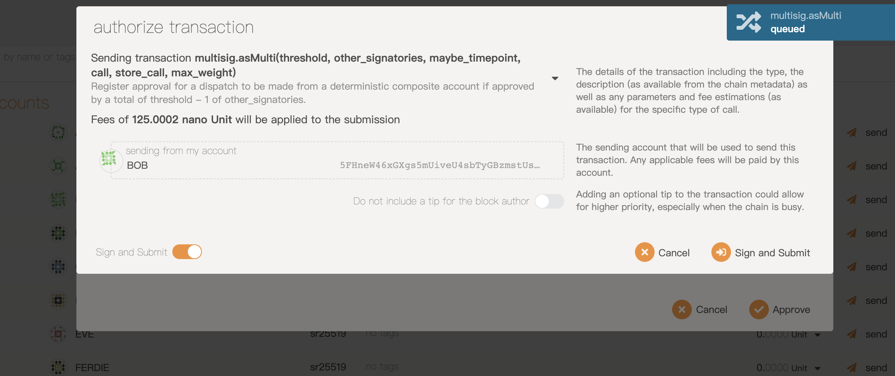

## FRAME Multisig

### Proof that the UI component works

### Proof that the embedded Multisig pallet works

Create multisig wallet

Deposit to the multisig wallet

Create multigis transfer

Alice signs

Bob signs

Multisig transfer is succeeded

Event

